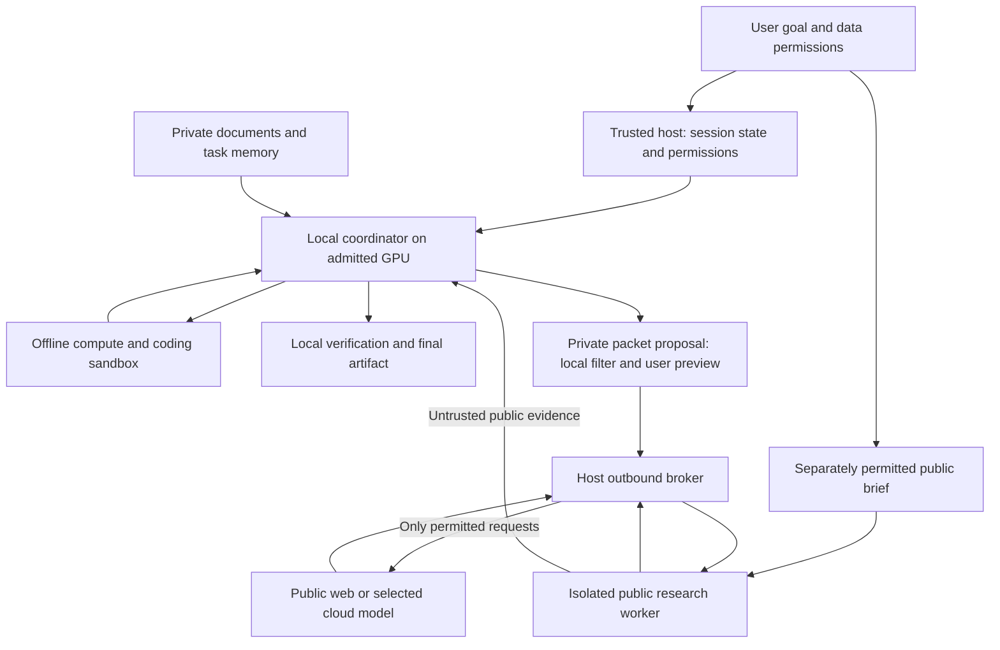

# Privacy-first agentic MVP

Date: 2026-09-11.

Status: **Owner priorities approved; architecture and implementation plan proposed.**
This is a design recalibration, not a privacy certification or implemented runtime.
Execution update: the owner subsequently instructed completion of the next sequence.
Implementation and bounded synthetic/local qualification are authorized by the
[execution plan](MVP_PRIVATE_AGENT_EXECUTION_V1.md); [runtime evidence](../MVP_PRIVATE_AGENT_BOUNDARY_REPORT.md)
remains in progress. Later paid and production-private gates still require their
specific evidence and authority.
The owner now prioritizes **privacy >= quality > savings > latency**, for
Manus-like multi-step work on a dedicated user-controlled GPU machine. The desktop
app is the control surface; it is not the assumed inference machine.

This decision supersedes the pending cloud-versus-Automatic comparison as the next
experiment. Its USD 29.10 proposal remains undispatched; no allowance is transferred.
The old relative-latency gate and mandatory 20% savings advancement gate are retired
for the new product experiment. Historical results, budgets and failures keep their
original meanings. Existing production policies and limits are unchanged by this document.

## 1. Product goal and decision order

Users should be able to delegate **general end-to-end agentic work**, initially
optimized for deep research, file auditing, website building and PowerPoint creation,
through to a checked deliverable while controlling what information leaves their
trusted devices. The current public-repository coding pilot does not establish
that capability. A cheaper completed model turn is not the unit of success; a
useful, accepted session within its disclosure permissions is. Coding is a supporting
tool for those jobs, not the primary product category or sole evaluation workload.
The four priorities are representative workloads, not an exhaustive task enum,
four isolated applications or a restriction on what the user may request.

Manus defines its product around delegated goals, planning, computer/tool execution
and delivered work products, with a persistent working environment. Its API describes
whole tasks and results across formats. That is the useful definition to adopt;
the vendor's claim of production-ready results is not independent evidence of
reliability. [Manus introduction](https://manus.im/docs/introduction/welcome),
[Manus task API](https://manus.im/docs/integrations/manus-api).

For SOAR, end-to-end means: understand the goal and constraints; acquire permitted
inputs; plan dependent work; choose and execute tools; observe results; recover or
replan; verify against the original requirements; deliver the requested artifacts
and authorized effects. Multi-step work may cross several categories and continue
after interruptions. Completion requires the result, not merely a plausible plan,
a successful tool exit, or asking the user to assemble intermediate outputs.

Use ordered constraints, not a weighted score that can exchange disclosure for
speed or lower cost:

1. **Privacy:** an operation must satisfy the user's data, destination and action
   permissions before it can be considered. No model confidence, urgency, budget
   shortage or quality problem can expand these permissions.
2. **Quality:** require the task's critical acceptance checks and verified final
   artifact. If no permitted route can finish, preserve progress and explain the
   missing capability. A safely blocked task is still unfinished.
3. **Savings:** compare total API cost per accepted session among routes meeting
   those constraints. Keep local compute and operating costs separate until measured.
4. **Latency:** report it and support user deadlines, cancellation and progress.
   Remove the previous 25% relative slowdown rejection. Keep finite per-operation
   timeouts, loop detection and resource caps; these protect operability rather
   than establish a competitive-speed requirement.

The initial quality floors below are proposed experiment targets, not measured
user expectations. The owner has reported the workload shift; no frequency or
retention statistics have been supplied.

## 2. What existing evidence changes

| Evidence in the current checkout | Implication under the new priorities |
| --- | --- |
| Original six-task planned-local comparison: 0 accepted versus cloud's 4; every planner failed before local execution | Retain the negative result. This primarily diagnosed planner contract failure, not local coding inability. |
| Clarified planned-local: one accepted exposed task, USD 0.077284, 159.149 seconds | Feasibility evidence. The latency is no longer a rejection reason. Its source-bearing cloud plan still needs disclosure authority, and planner value across tasks remains unproven. |
| Local-first: one submitted patch passed the original checks but failed independent review | Private/local execution alone is insufficient; quality verification remains essential. |
| Local draft plus critic: one accepted task, USD 0.039000, 55.552 seconds; no repair | Useful quality signal, but the critic sees full baseline/candidate source. Do not apply this unchanged to private work. |
| Automatic chooses cloud for three of six source baselines | Source size is a feasibility rule. It must never determine permission to disclose. |
| 170 scoped tests, two synthetic production fixtures and both typechecks pass | Reusable runtime mechanics, not evidence of privacy, general agent capability or release. |

See [readiness](../MVP_READINESS.md), [planned-local execution](../MVP_PLANNER_LOCAL_EXECUTION_REPORT.md)
and [Automatic implementation](../MVP_AUTOMATIC_ROUTING_IMPLEMENTATION_REPORT.md).

Read-only source audits found these integration boundaries:

| Current code | Verified scope and required adaptation |
| --- | --- |
| [Patch controller](../../src/main/patch-runs/controller.ts), create | Requires public-source acknowledgement. Preserve that restriction until a private workflow has its own enforced policy. A checkbox is not content classification. |
| [Patch admission](../../src/main/patch-runs/worker.ts), `admitPreparedRequest` / `request.prepare` | Binds provider/body, phase, fee and literal configured keys. Add disclosure admission before reservation and dispatch for every phase, including the first plan. |
| [Planner preparation](../../runtime/patch-worker/coding_execution.py), `plan` | Sends objective, command, inventory and source excerpts. Replace private-context export with a separately permitted task packet. |
| [Critic context](../../src/main/patch-runs/critic-context.ts), `prepareCriticContext` | Includes complete baseline, candidate and patch. Keep this contract for permitted public tasks; a partial critique needs a separately named contract and cannot claim full-source review. |
| [Python transport](../../runtime/patch-worker/worker.py) | Performs HTTP with credentials after host acknowledgement. Move transport and credentials behind the trusted host broker; denying sandbox networking alone is insufficient. |
| [Existing egress policy](../../src/main/cloud-egress-policy.ts), `evaluateCloudEgressPolicyV1` | Reuse consent/provenance binding and secret scans. It is review-specific, rejects tool messages/definitions, and lacks a general confidentiality/derivation policy. Do not attach it unchanged and claim coverage. |
| [Repository tool registry](../../src/main/tools/tool-registry.ts) and [session runner](../../src/main/agent/run-session.ts) | Reuse bounded acquisition, event history and context compilation. General web research, private document processing, durable agent jobs and artifact delivery need implementation. The separate v2 hybrid session path remains fake-only. |

These are capability gaps against the new requirement, not a finding that historical
public experiments leaked private user data.

## 3. Trusted boundary and data rules

The proposed trusted boundary contains the local app host, the specifically
admitted owned GPU server, their storage and controlled communication channel.
An endpoint called "local", a zero-fee price or ownership alone proves none of
this. Before private inputs: verify server identity and access control, encrypted
remote transport, process isolation, logs/caches, upstream forwarding and outgoing
network behavior. Existing API-only access cannot verify all these properties;
GPU deployment verification remains an explicit prerequisite. Loopback transports
may use local IPC; remote plaintext endpoints cannot qualify for private inputs.

Protect user instructions, files, private URLs, source code, tool results, browser
state, summaries, embeddings, plans, failures and final artifacts. Also account for
outbound queries, destination choices and filenames: they can reveal private intent
without reproducing an identifier. Provider retention promises do not change whether
disclosure occurred. External sites necessarily observe permitted queries and network
metadata; this design does not promise anonymity or eliminate traffic analysis.

Use a coarse host-owned classification initially:

- **Private:** default for imported material and private session context.
- **Public:** independently acquired public information or an explicitly designated
  public task brief, with recorded origin. Unknown provenance remains private.
- **Released for an operation:** an exact selected packet with destination, purpose
  and bounded permission. This is an exception for that operation, not a global
  relabeling of the source as public.
- **Credentials:** usable only by the credential broker for their authorized
  service; never passed to model context or included in a disclosure packet.

Release to one provider does not permit forwarding to another service. Returned
answers and later summaries derived from that packet retain its restrictions.

All model output inherits the restrictions of **all context available to that
invocation**, including memory, summaries and tool results. The model cannot label
its own answer safe to send. Redaction, summarization, pseudonyms or removing names
do not automatically declassify business facts or code. Detector absence is not
release authority. A public worker must have an isolated context, filesystem and
storage; starting a new message in the private coordinator is not isolation.

Threat coverage includes prompt injection in fetched documents/tool output, accidental
handoff, malicious generated commands, stale grants and cross-session context mixing.
The MVP does not claim protection after compromise of the trusted host/kernel or
malicious GPU operator. Model filters are fallible; boundary tests cover enumerated
surfaces, not universal information-flow proof.

## 4. Agent design

Use one general job loop and extensible capabilities. A job records its goal,
constraints, inputs and provenance, disclosure/action permissions, resource budget,
required deliverables/effects, acceptance checks and current verified state. Work
nodes record dependencies, required capabilities, allowed context, artifacts and
verification evidence. Task labels are optional metadata; they must not select one
of four hardcoded controllers. User edits revise the job contract without erasing
the prior state or permissions.

Compose bounded capabilities for retrieval, browser interaction, file operations,
code/compute, document transformation, rendering, verification and external actions.
Reusable recipes/skills can guide common work; the agent can compose them and write
small sandboxed helper programs for unfamiliar jobs. New helpers inherit the same
filesystem/network rules. New connector or executable installation requires host
admission, never instructions found in a webpage or document. Each artifact type
has a validator; lack of a validator or tool is an explicit capability gap rather
than a forced conversion into a supported category.

Use a planning/acting/observing/verifying loop with bounded recovery. Leases retain
an allowed model while useful progress continues. Independent nodes can use separate
contexts, serialized initially on one GPU and parallelized only within measured
resource capacity. Reassess capability at meaningful boundaries, but validate data
permission on **every dispatch**, even when the model lease is unchanged.

Manus describes an action-observation loop, filesystem-backed recoverable context,
and keeping failure evidence available; its research feature uses isolated contexts
for independent work. SOAR should adopt those mechanisms while retaining private
lineage and deterministic host checks. Cache affinity may improve cost later; it
never justifies sharing private context between users or tasks. [Context engineering](https://manus.im/blog/Context-Engineering-for-AI-Agents-Lessons-from-Building-Manus),
[Wide Research](https://manus.im/docs/features/wide-research).

The local coordinator owns planning, private retrieval, execution, final synthesis
and task status. A cloud model is an optional consultant on permitted information;
it receives no private filesystem, unrestricted tools or ambient session history.
Its plan/critique is advisory and locally verified. Persistent failures can trigger
more local reasoning, deterministic checks, a narrower public consultation, or a
clear pause. They cannot trigger full-context cloud fallback.

Bootstrap public research from a separately designated brief **before private
context is introduced**, or ask the user to release the exact new work order.
A coordinator that has read a private budget cannot silently turn it into a search
query. A static domain allowlist does not authorize all possible query strings.
Public results remain untrusted even when passed through a local model.

Example: compare public software options with a confidential internal operating
plan. The public worker researches the approved product category and features.
Local tools read the plan and calculate fit. Local synthesis combines the two and
produces a report. If a private condition requires a new external query, keep it
local or show the proposed query and recipient for release. Do not send the private
plan to cloud to obtain the initial decomposition.

Every outgoing operation is mediated outside model-generated code. Cover cloud and
local model transport, search query/body, URL path/query, redirects, headers, browser
subresources, connectors, uploads, readiness checks, logs/telemetry and error reporting.
Verifiers, renderers, package/install commands and spawned subprocesses are covered
as well. Workers have no direct internet route or ambient credentials. Enforce that through
the OS/container/proxy boundary, not just a tool function. In the first slice, use
controlled text search/fetch without authenticated browser cookies or arbitrary
JavaScript; a general browser requires separately isolated cookies, downloads,
clipboard and all subresource requests before admission.

The host constructs the final serialized payload and validates a permission bound
to task, data versions, exact bytes, destination/service account, operation, purpose,
policy version, expiry and use limit. User previews include everything task-derived
that will leave, with credential material excluded. Grant changes, payload drift,
redirects or destination changes trigger re-admission. Reserve permission and fee
atomically before dispatch; unknown outcomes consume their allowance and do not
authorize a replay. After the broker durably acknowledges revocation, no new dispatch
may commit. Already committed/in-flight requests can still deliver and are reported
as possibly disclosed; revocation cannot recall them or prove recipient deletion.
Public-only requests may run under a bounded preauthorized capability to avoid
approval on every harmless fetch. That capability cannot accept private-derived text.

Preserve one local canonical job record; each worker receives only its allowed
projection. Persist task requirements, artifact versions, verified progress, pending
operations and grants locally. Resume from verified checkpoints, revalidate permissions
and never repeat an uncertain external action automatically. Keep independent model
context resets and at least one pause/resume case in evaluation. A context compactor
must preserve confidentiality and provenance; compression is not disclosure control.

## 5. User experience and requirements

Start a task with **Keep inputs private**. Display the admitted compute destination
and independently configurable public-web permission. This mode disables cloud
model calls, including on public briefs; it is not an "offline" claim when web
research is enabled. The separately enabled cloud-help mode can use a public worker
without authorizing private-context disclosure.
An explicit offline setting disables external networking as well.

The optional **Cloud help with selected information** mode shows a concrete packet,
recipient and reason when private-derived content needs release. Approve once for
that bounded operation, revise the packet, or continue locally. Existing permission
continues within its scope; avoid repetitive prompts. Show task progress, artifacts,
what was sent, why a step is waiting, and Stop. A new destination or broader data
scope needs a new decision. Never imply "nothing left the device" merely because
the model ran locally.

| Priority / requirement | Acceptance condition |
| --- | --- |
| P0: mandatory outbound mediation | No worker bypass; denied/expired/changed packets transmit zero bytes; unknown connections stop the privacy gate. |
| P0: restricted context projections | A worker without private authority cannot access private files, memory, tool outputs or another task's cache. Derived summaries retain restrictions. |
| P0: general agent execution | One job contract and loop compose tools across tasks; complete the four priority artifact contracts and transfer check below. A blocked or unsupported task is counted unfinished; tool calls, outlines and patches alone are not the product outcome. |
| P0: local filtering and previews | Run selected detectors inside the boundary; preserve exact offsets, original private artifact and proposed packet. Failed/truncated scans block release. |
| P0: local verification | Check facts/calculations and audit provenance, browser-test websites, render every PowerPoint slide and inspect package internals. A cloud critic's partial view is explicitly limited. |
| P0: durable progress and stop | Cancellation prevents new dispatch; restart preserves grants and labels, reconciles unknown outcomes, and cannot duplicate an external effect. |
| P0: retention and access | Private stores and derived indexes are access-controlled; no content telemetry by default. Task deletion covers owned workspaces, caches, embeddings and logs, with backup/external-recipient limits disclosed. |
| P0: action permissions | External sending, upload, purchase or modification binds exact target/effect and requires appropriate user authority. Model tool text cannot grant it. |
| P0: document and artifact support | Local bounded parsers for the declared text, CSV, PDF and Office formats used in the pilot; actual website and PPTX outputs. Disable macros, embedded executable activation and automatic external-resource retrieval. Unsupported formats are explicit gaps. |
| P1: richer modalities | Scanned-document OCR, complex spreadsheet models and advanced slide media after the first supported document pipeline passes. |
| P1: browser and connectors | Authenticated read and then scoped writes, each with full transport/isolation coverage and no duplicate action on resume. |
| P2: learned routing / broad integrations | Consider only after accepted private sessions provide training/evaluation evidence. |

The first vertical slice must deliver examples of all four priority job types. Use synthetic private
briefs and bounded local files plus controlled public pages; do not substitute a
coding benchmark for the owner's new workload. The app presents Goal, Sources,
Progress and Deliverables with one shared permission model. Avoid exposing model
policy names as the user's primary task choices.

| Family | Required deliverable and quality gate | Additional privacy surface |
| --- | --- | --- |
| Deep research | A report that answers the brief, reconciles conflicting evidence and states uncertainty, plus a source ledger. Verify each material factual claim against retained evidence; citations must resolve and support the claim. | Queries, visited URLs, downloaded pages, citations and private research intent. Public retrieval workers do not receive private hypotheses by default. |
| File auditing | Complete admitted-file inventory and traceable findings with file/record locations, evidence and reconciled calculations where relevant. Verify seeded missing/duplicate/inconsistent records and report unreadable/excluded files. Original files remain unchanged unless modification was requested. | Filenames, directory structure, personal/business records, parser logs and generated audit reports. Permission to read a folder does not permit uploading it or deleting duplicates. |
| Website building | Runnable site source/assets and a verified local preview. Test requested interactions, keyboard access, representative responsive views, console/runtime failures and asset completeness; inspect screenshots. A mockup or code patch alone fails. | Private brief, generated copy, source maps, embedded config, assets and browser subresources. Deny unapproved CDN fonts, images, analytics and generated JavaScript networking. Publication binds the actual public payload and destination. |
| PowerPoint creation | A genuine editable `.pptx`, opening without repair in the declared supported application, rendered and inspected slide by slide for content, order, legibility, clipping/overlap, charts and source accuracy. A ZIP, outline or alternate renderer alone cannot prove Microsoft PowerPoint compatibility. | Notes, comments, hidden slides, metadata, thumbnails, embedded workbooks/OLE/media and external relationships as well as visible content. Inspect the complete package before release; unsupported inspection is incomplete, not clean. |

Local parsers/renderers run without network or ambient credentials, with size,
archive-expansion and process limits. Website preview browsers and trusted static
renderers are separate from unrestricted internet browsing. Rich cloud vision or
slide-generation APIs would be new disclosure destinations, not implicit helpers.
User-owned source data is used only after synthetic gates and deployment verification.

This is still an entry experiment, not a claim of Manus-equivalent breadth.
Authenticated workflows and external actions remain named follow-on capability
gates. Creating a website or deck does not itself authorize public hosting, uploads
or email. When the user explicitly requests publication or sharing, prepare and
verify the final artifact, then use permission already granted for the exact action
or obtain any missing scope. Preserve that task requirement until delivered.

## 6. Local privacy filtering

Evaluate OpenAI Privacy Filter first as a learned span detector alongside existing
secret/path rules. Compare Presidio for organization-specific recognizers and
Gitleaks for coding secrets; do not build a new detector from scratch. See the
[tool assessment and calibration plan](../PRIVACY_FILTER_RESEARCH.md).

Filtering helps find sensitive spans, suggest a minimal packet and prevent accidental
disclosure. It is not the authority that changes private data into public data.
Business strategy, proprietary algorithms and identifying combinations can survive
PII removal. Keep structured calculations on original local values; use task-local
pseudonyms only in permitted consultant packets, restore names locally, and check
that masking has not changed relationships, dates, quantities or task meaning.

Inspect document ingestion and each outgoing packet; use the latter as the decisive
transport check. Cache scan results only for exact artifact, model, decoder and policy
versions. Retain scan details locally with source restrictions. An unavailable
detector, unsupported modality, over-limit input or malformed span result blocks
release while permitting otherwise valid local work. Do not upload private text
to a hosted redaction demo or API to decide whether it may be uploaded elsewhere.

## 7. Small experiments with explicit stop conditions

All targets here are proposed. Freeze exact tasks, rubrics, model/dependency revisions,
request/compute ceilings and any paid allowance before execution. No live model work
is authorized by this design document. Reuse existing isolated runtime and accounting;
do not build another general evaluation framework.

**A. Boundary and filter qualification, using synthetic material.** First exercise
all outbound adapters against controlled receivers, with canaries in task text,
source, tool errors, summaries, private URLs and cross-session memory. Include encoded
values, prompt injection, redirects/subresources, stale/revoked grants, concurrent
use, restart, cancellation, unknown transport and telemetry. A canary check is not
enough: reconcile every observed connection and request with admitted provenance.
Any unapproved transmission or unaudited route fails immediately. In a deterministic
fixture, vary private inputs while holding the public brief fixed: the public
worker's outbound transcript must remain identical unless a new release occurs.
For stochastic live runs, inspect lineage and authority rather than interpreting
random wording differences as proven leaks. Run the separate
small detector comparison without any external inference; detector accuracy and
boundary correctness are different outcomes. Do not introduce real private material
until the owned GPU/server boundary is also verified.

**B. Four complete local sessions, one per family.** Use a deep-research brief,
a bounded file audit, a website brief and a PowerPoint brief, each with synthetic
private information. Require planning, multiple dependent tool actions, a checked
final deliverable under the artifact contracts above and zero unapproved
disclosure. Exercise context restart or pause/resume in at least one. All four
must meet their frozen critical requirements. One failure stops expansion and
identifies the missing capability; a safe refusal does not count as success.

**C. Eight fresh tasks, two per family, comparing permitted routes.** Compare local
inference with the same system plus bounded cloud consultation on explicitly permitted
packets: sixteen sessions, balanced order, same inputs, permissions and frozen rubrics.
Keep public retrieval evidence comparable and record actual external interactions.
Neither arm receives a hidden permission advantage. The candidate being considered
for advancement is the bounded-cloud-help policy; local-only is its regression
baseline. Proposed candidate quality floor is at least 7/8 accepted and at least
one accepted in every family, with no new critical regression on a baseline-accepted
task. This is per-policy acceptance, never the union or best result of both arms.
Report local-only against the same floor separately. Every accepted task must pass all
its critical checks; the floor is a pilot screen, not statistical generalization.
Retain all failed, interrupted and unrun assignments and fees. Any privacy violation
fails the entire pilot; missing coverage is inconclusive, never a pass.

Report cost per accepted session, permitted disclosures and their purpose, private
data retained locally, user interventions, quality defects, total latency and peak
local resource use. Local versus cloud-assisted cost differences are descriptive
for those routes; **no claim of savings against cloud-only follows without a fresh
comparable cloud baseline**. A later cloud-only reference may use synthetic or
explicitly public/released inputs, never involuntary disclosure of real private data.
No 20% savings threshold or relative latency threshold overrides privacy/quality.

**D. Generality and composition check.** After freezing the runtime, reveal one
fresh task outside the four priority packs: organize a synthetic onboarding workspace
from policies, a roster and an approved public packet; reconcile conflicting dates;
produce role-specific checklists, valid calendar files and unsent email drafts.
Introduce a changed start date and a pause/restart midway. Permit existing tools,
skills and sandboxed helper code, but no new task-specific orchestration branch
after revelation. Require every critical output/evidence check, consistent propagation
of the changed date, preserved permissions and zero unauthorized or duplicate effects.
This proposed transfer test is additional to Stage C, with its own bounded execution
plan. It demonstrates limited composition rather than universal competence. Future
owner tasks may combine audit, research, site and deck in one job; support those
dependencies through the same job contract rather than separate apps.

After these gates, require fresh owner-representative tasks and actual app
acceptance, including scoped browser/connector actions, before a general agentic
MVP claim. Preserve the old four untouched coding tasks; do not relabel them as
representative private-agent confirmation or open them during this design work.

If the local model cannot meet the quality floor without forbidden context export,
the response is better local capability, narrower supported workflows stated openly,
or explicit user-selected disclosure. Do not weaken the privacy default or declare
the product successful from blocked tasks. If privacy and quality pass but cost
does not improve, retain the privacy result and investigate economics separately.

## 8. Implementation order and research basis

1. Add versioned task privacy policy, destination trust and host disclosure admission
   to the existing request lifecycle; keep legacy public coding separate. Move HTTP
   and credentials to the broker and prove network non-bypass before private ingestion.
2. Integrate one selected local detector, packet preview and provenance-preserving
   storage/compaction. Qualify filters and all transport surfaces.
3. Extend the local session with controlled public research, bounded document audit,
   local website building/preview and PowerPoint generation/rendering. Reuse offline
   compute and coding as tools. Deliver the four-session slice with real artifacts.
4. Run the eight-task permitted-route comparison and generality check; then complete real app, browser/action
   and owner-task gates. Optimize cost only after accepted private work exists.

External evidence checked on 2026-09-11:

- [Minions implementation](https://github.com/HazyResearch/minions/blob/main/minions/minion.py)
  provides cloud/local collaboration and an optional privacy path that extracts PII
  and asks the local model to rewrite queries and worker responses. Cloud still
  consumes derived worker output. Borrow bounded delegation; do not infer a
  non-disclosure guarantee from redaction or the supervisor pattern.
- [PyroDash README](https://github.com/Pyromind-Dynamics/PyroDash/blob/main/README_zh.md)
  describes model-emitted offload and cost/accuracy optimization. SOAR can treat an
  offload signal as a capability request, never as permission to export its context.
  This review does not re-certify its coding adapter or reported benchmark results.
- [Manus Browser Operator](https://manus.im/docs/features/browser-operator) documents
  multi-step work through local browser sessions and a separate cloud browser.
  This supports the workload direction; local browser operation alone does not
  establish where model-visible content is processed.
- [Anthropic sandboxing](https://www.anthropic.com/engineering/claude-code-sandboxing)
  combines filesystem and network isolation. Borrow enforced capabilities so agents
  can act autonomously within a boundary rather than relying on repeated prompts.
- [Long-running agent harnesses](https://www.anthropic.com/engineering/effective-harnesses-for-long-running-agents)
  emphasize incremental progress, durable artifacts and end-to-end verification.
  Apply those ideas to local sessions while preserving information restrictions.

These are design inferences from primary sources, not comparative privacy benchmarks.

Open decisions: acceptable task-specific disclosure examples; GPU trust and
deployment verification; measured Chinese/mixed-language filter quality; retention
defaults and resource limits. Engineering can begin the synthetic boundary slice
without assuming answers about real private data or cloud permissions. No delivery
date is promised before these capability gates are measured.
